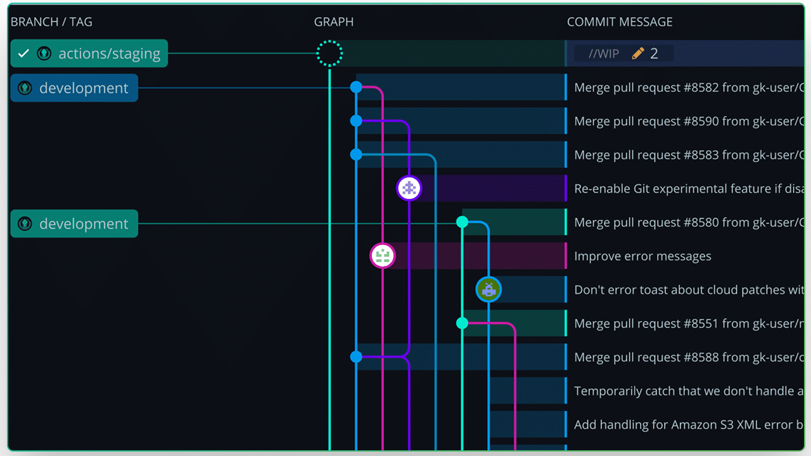
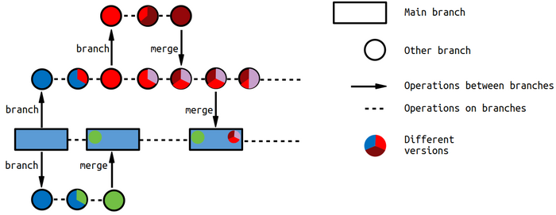

📖 **Git** es un sistema de control de versiones distribuido que permite **registrar**, **gestionar** y **recuperar** cambios en el código fuente de un proyecto a lo largo del tiempo.

- `Guarda` historial de cambios.
- `Permite` volver atrás si algo falla.
- `Facilita` trabajo en equipo sin pisarse el código.
- Usa ramas (branches) para `desarrollar` nuevas funciones sin romper lo estable.
  
---

## 🎋RAMAS



Una rama (branch) es una línea de trabajo independiente que nace desde un punto del historial del proyecto y permite desarrollar cambios sin modificar la versión principal.
Una rama es una copia lógica del estado actual del proyecto donde puedes trabajar con libertad.

- Parte desde un `commit existente`
- Tiene su propio `historial`
- No `afecta` a otras ramas
- Puede `fusionarse` (merge) o `eliminarse`
  
---

## 😀 HEAD

**HEAD** es el puntero que indica el commit actual donde estás trabajando.
Marca tu posición en el historial.
```
main: A — B — C              A — B — C — D              feature: A — B — C — d — e               feature: A — b 
              ↑  — commit —>             ↑  — switch —>                          ↑  — reset —>                ↑
            HEAD                       HEAD                                    HEAD                         HEAD
```
--- 
## ⚡FASES Y ESTADOS DE GIT PARA HACER UN COMMIT

Git funciona como un sistema de 3 zonas por las que pasan tus archivos antes de guardarse definitivamente.


### 🟥 1. Working Directory (Modificado)

**Donde editas archivos:** `Cambias` código | `Creas/borras` ficheros | Git `detecta` cambios
  
### 🟧 2. Staging Area / Index (Preparado)

**Zona intermedia de selección:** Decides qué `cambios` entran al commit | No todo tiene que guardarse

```git
  git add .
  git add main.java
```
  
### 🟩 3. Repository (.git) (Confirmado)
**Historial permanente:** Se `crea` un commit | Queda `registrado` para siempre | Puedes `volver` a él cuando quieras

```git
  git commit -m "mensaje"
```

### 🟦 Remote Repository (Push)

**Servidor compartido** (ej: GitHub, GitLab): `publicas` tus commits | `sincronizas` con el equipo | `copia` de seguridad externa

```git
  git push
```
---

## ↩ REVERTIR ESTADOS


### 🟥 1. Working Directory (Modificado)

Cuando aún **no has hecho add**, pero has `modificado` el archivo de alguna manera: `borra` cambios locales | `vuelve` al último commit

```git
git restore archivo.java
git restore.
```

### 🟧 2. Staging Area (Preparado / Staged)

Cuando ya `hiciste add` y el archivo está listo para el commit: Lo `quita` del **staging** | `Vuelve` a estado **modificado** (no pierde cambios)

```git
git restore --staged archivo.java
git reset archivo.java
```

### 🟨 3. Local Repository (Commit)

##### ✏️ git commit --amend
    # Modifica/reescribe el último commit A — B — C → A — B — C'
    # Permite corregir mensaje o añadir archivos olvidados

##### 🔁 git reset --soft HEAD~1 
    # Deshace commit pero mantiene cambios staged: A — B — C → A — B (HEAD)
    # Hiciste commit demasiado pronto y quieres rehacerlo

##### 🧹 git reset --mixed HEAD~1        
    # Deshace commit y deja archivos modificados (NO staged): A — B — C → A — B (HEAD)
    # Limpia staging (Default)

##### 💣 git reset --hard HEAD~1         
    # Borra commit y cambios completamente (peligroso): A — B — C → A — B (HEAD)

### 🟩 4. Remote (Push)

Cuando ya hiciste push y los cambios están en el servidor compartido: Requiere cuidado porque afecta a otros | Se recomienda revertir, no borrar historia |
  
```git
git revert HEAD                 # crea commit inverso (seguro)
git push --force                # reescribe historial remoto (peligroso)
git pull                        # sincroniza antes de seguir trabajando
```

--- 

## ♻ FUSIONAR RAMAS

 

⭕ **GIT MERGE I:** 
- Es el mecanismo que permite integrar en una `rama principal` el trabajo que se ha `desarrollado` de forma aislada en otra:
- `Nadie trabaja` directamente sobre *main* (cualquier error afectara a todo el equipo) 
- Se desarrolla en una `rama independiente` *desarrollo*.
- Esa rama funciona como un espacio seguro donde puedes `programar`, `probar`, `romper` y `rehacer` sin comprometer la estabilidad del proyecto.

---



⭕ **GIT MERGE II:** 
- Toma todos los `commits` de esa rama y los **une al historial** de la rama destino.
- No se copia los archivos manualmente, sino de **combinar historias** completas de cambios.
- Git `analiza` qué se ha modificado en cada lado y construye un nuevo estado:
  - Si nadie tocó las mismas partes del código, la `unión es automática`;
  - Si dos personas cambiaron lo mismo, Git te pide que resuelvas el conflicto para decidir qué versión conservar.
    
---

### 💻 Comando merge LOCAL:

```bash
git commit -m'mensaje'          : # Primero tener todo commit
git switch main                 : # Después ir a la rama destino
git merge feature               : # Se fusiona la rama

# recomendación borrar la rama
```
### 🌐 Comando merge "REMOTO":

Cuando trabajas con remoto (GitHub), el flujo tiene 2 fases:
1. fusionas en local
2. subes el resultado al remoto
   Escenario: maiun(remoto) y feature (local)

```bash
git switch main                 : # Después ir a la rama destino
git pull                        : # sincronizas tu main local con el remoto
git merge feature               : # Se fusiona la rama
¿?                              : # Se Resuelven conflictos si hay
git push                        : # ahora el remoto tiene el merge

# recomendación borrar la rama
```

### ✔ Situaciones iniciales
```git
git clone <url>                  : # Se clona el proyecto en local

LOCAL               REMOTO
main  ─────→      origin/main    : # main local viculado con remoto
....................................................................
git switch -c login              : # Creamos nueva funcionalidad

LOCAL                 REMOTO
main    ─────→     origin/main
login      
....................................................................
git push -u origin login         : # crea la rama remota/vincula
LOCAL                 REMOTO
main    ─────→     origin/main   : # rama local vinculada a remota
login   ─────→     origin/login
---
....................................................................
git push                         : # Ya funciona siempre
``` 
---

### 🎛 COMANDOS BÁSICOS:

```bash
⚙️ Configuración inicial (una sola vez)

git config --global user.name "TuNombre"        : # Configura tu nombre de autor.
git config --global user.email "tu@email.com"   : # Configura tu correo de autor.
git config --list                               : # Muestra toda la configuración actual. 

📁 Crear / obtener repositorio

git init                                       : # crear repo nuevo
git clone URL                                  : # clonar repo remoto

🔎 Estado e historial

git status                                     : # ver estado actual (🟢 stagged/ 🔴 no stagged)
git log                                        : # historial completo
git log --oneline --graph --all                : # historial compacto visual
git diff                                       : # ver cambios no confirmados

🌿 Ramas

git branch                                     : # listar ramas
git branch new-rama                            : # crear rama
git switch new-rama / git checkout new-rama    : # cambiar de rama
git switch -c new / git checkout -b new        : # crear y cambiar
git branch -d rama                             : # borrar rama

☁️ Sincronizar con remoto

git fetch                                      : # traer cambios sin mezclar
git pull                                       : # traer y fusionar (fetch + merge)
git push                                       : # subir commits
git push -u origin rama                        : # subir rama nueva y fijar upstream

🧹 Trabajo temporal y limpieza

git stash                                      : # guardar cambios temporales (sin commit)
git stash list                                 : # muestra la lista de stash  
git stash pop                                  : # recuperar esos cambios / recupera siempre el stash@{0} (último)
git stash apply stash@{1}                      : # recupera el stash@{1}
git clean -fd                                  : # borrar archivos/carpetas no trackeados (cuidado)

```
