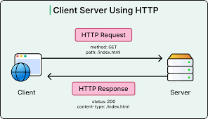

# 🌐 Comunicación HTTP y Consumo de APIs en Java


## ❓Qué es HTTP

**HTTP** *(HyperText Transfer Protocol)* es el protocolo que `permite la comunicación` entre aplicaciones a través de Internet. Define cómo un cliente, como un navegador web o una aplicación Java, puede solicitar información a un servidor y cómo este responde a dicha solicitud. 

HTTP funciona siempre siguiendo un modelo de **petición–respuesta:** el cliente envía una petición y el servidor devuelve una respuesta con un código de estado y, en muchos casos, datos asociados.
  
<p align="center">
  
</p>

---

## 👏 PETICIÓN y RESPUESTA

Una **PETICIÓN** HTTP es la forma en la que el navegador o una aplicación solicita algo al servidor. Esta petición incluye varios elementos importantes:

  - `Versión`: indica la **VERSIÓN** del protocolo que se está utilizando. (*HTTP/1.1 o HTTP/2*)
  - `URL`: es la **DIRECCIÓN** exacta del recurso que se solicita. `https://www.example.com/about`.
  - `Método`: indica qué **ACCIÓN** se desea realizar
    - `GET` se utiliza para obtener información.
    - `POST` para enviar nuevos datos.
    - `PUT` para modificar información existente y DELETE para eliminar recursos.
  - `Headers`: contienen información adicional, como la información de **autenticación**.
  - `Body`: en algunos casos, la petición **incluyen** datos. (formato JSON)

 ---
 
Una **RESPUESTA** HTTP es la contestación del servidor a la petición realizada por el cliente. Esta respuesta también tiene una estructura definida:

- `Código de estado HTTP`: es un **número** que indica si la petición se ha procesado correctamente o si se ha producido un error. [ResponsesCats](https://http.cat/)
- `Headers`: proporcionan **información** sobre la respuesta, como el tipo de contenido que se envía.
- `Body`: contiene los **datos** reales que el servidor devuelve.

### 🗣️ Tipos de respuestas en una API REST (HTTP) 

| Categoría | Código | Nombre | Uso habitual |
|---------|-------|--------|-------------|
| ✅ Éxito | 200 | OK | Petición correcta, devuelve datos (GET) |
| ✅ Éxito | 201 | Created | Recurso creado correctamente (POST) |
| ✅ Éxito | 204 | No Content | Operación correcta sin contenido (DELETE / PUT) |
| ❌ Cliente | 400 | Bad Request | Datos incorrectos o petición mal formada |
| ❌ Cliente | 401 | Unauthorized | Falta autenticación o es incorrecta |
| ❌ Cliente | 403 | Forbidden | Sin permisos para acceder al recurso |
| ❌ Cliente | 404 | Not Found | Recurso no encontrado |
| ❌ Cliente | 409 | Conflict | Conflicto con el estado del recurso |
| ⚠️ Servidor | 500 | Internal Server Error | Error genérico del servidor |
| ⚠️ Servidor | 502 | Bad Gateway | Error al comunicarse con otro servidor |
| ⚠️ Servidor | 503 | Service Unavailable | Servicio no disponible temporalmente |
| 🔁 Redirección | 301 | Moved Permanently | Recurso movido de forma permanente |
| 🔁 Redirección | 302 | Found | Redirección temporal |
| ℹ️ Informativo | 100 | Continue | Continuar con el envío de la petición |

---

## 🏢 API

**HTTP** se utiliza principalmente para `consumir APIs`. Una API es un servicio que expone información o funcionalidades a través de URLs accesibles mediante peticiones HTTP. 

- Estas APIs suelen devolver los datos en `formato JSON`.
- Un formato de texto estructurado muy común en aplicaciones modernas por su simplicidad y facilidad de uso.

<p align="center">
 
</p>
---

## APIPOKEMON

Es una API donde se puede hacer peticiones y tiene una documentación para cada endpoint que llames. Te dice que tipo de información estará en tu respuesta.
Para el endpoint `https://pokeapi.co/api/v2/`, la información que nos llega si lo ponemos en la url de nuestro navegador nos saldrá esto:


Para poder luego almacenar esa información en JAVA, es necesario crear una clase por cada estructura que haya, para el ejemplo anterior sería algo así:

```java
public static class Pokemon {

   String ability",
   String berry,
   String berry-firmness,
   String berry-flavor,
   String characteristic,
   String contest-effect,
   String contest-type
   
   ..........más............

   -- GETTER y SETTERS --
}
```

**pom.xml**:
```xml
<?xml version="1.0" encoding="UTF-8"?>
<project xmlns="http://maven.apache.org/POM/4.0.0"
         xmlns:xsi="http://www.w3.org/2001/XMLSchema-instance"
         xsi:schemaLocation="http://maven.apache.org/POM/4.0.0 http://maven.apache.org/xsd/maven-4.0.0.xsd">
    <modelVersion>4.0.0</modelVersion>

    <groupId>org.example</groupId>
    <artifactId>http</artifactId>
    <version>1.0-SNAPSHOT</version>

    <properties>
        <maven.compiler.source>25</maven.compiler.source>
        <maven.compiler.target>25</maven.compiler.target>
        <project.build.sourceEncoding>UTF-8</project.build.sourceEncoding>
    </properties>

    <dependencies>
        <dependency>
            <groupId>com.google.code.gson</groupId>
            <artifactId>gson</artifactId>
            <version>2.11.0</version>
        </dependency>
    </dependencies>

</project>

```

**Main:** 
```java
package org.example;

public class Main {
    public static void main(String[] args) {

        try {
            HttpClientPokemon http = new HttpClientPokemon();

            // Obtener los Pokémon (solo nombres)
            for (HttpClientPokemon.Pokemon p : http.getPokemons()) {
                System.out.println(p.name);
            }

        } catch (Exception e) {
            e.printStackTrace();
        }
    }
}

```
**HttpClientPokemon**
```java
package org.example;

import com.google.gson.Gson;
import java.io.IOException;
import java.net.URI;
import java.net.http.HttpClient;
import java.net.http.HttpRequest;
import java.net.http.HttpResponse;
import java.util.List;

public class HttpClientPokemon {

    // URL de PokeAPI
    private final String url = "https://pokeapi.co/api/v2/pokemon?offset=20&limit=1328";

    // Cliente HTTP
    private final HttpClient client = HttpClient.newHttpClient();

    // Metodo principal que hace la petición y devuelve los Pokémon
    public List<Pokemon> getPokemons() throws IOException, InterruptedException {

        // Construcción de la petición GET
        HttpRequest request = HttpRequest.newBuilder()
                .uri(URI.create(url))
                .GET()
                .build();

        // Envío de la petición
        HttpResponse<String> response =
                client.send(request, HttpResponse.BodyHandlers.ofString());

        // Parseo del JSON con la Clase con la misma estructura que la información de dentro
        Gson gson = new Gson();
        PokemonResponse data = gson.fromJson(response.body(), PokemonResponse.class);

        return data.results;
    }

    // Clase interna (modelo Pokémon)
    public static class Pokemon {
        String name;
        String url;
    }

    // Clase interna (estructura JSON)
    public static class PokemonResponse {
        List<Pokemon> results;
    }
}
```

