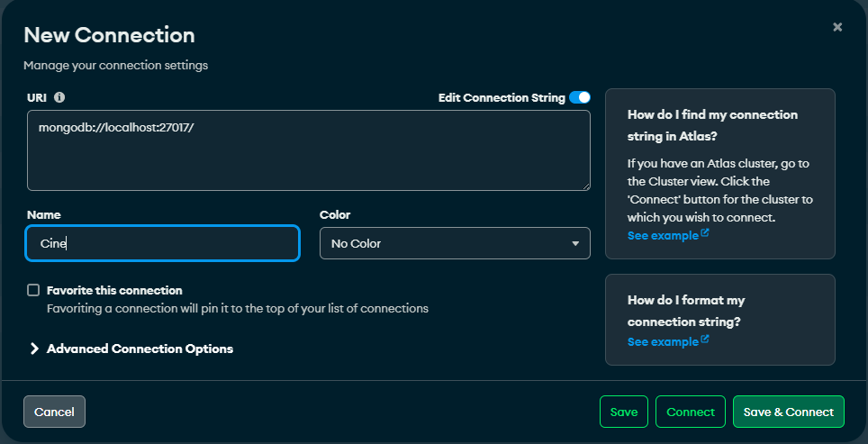
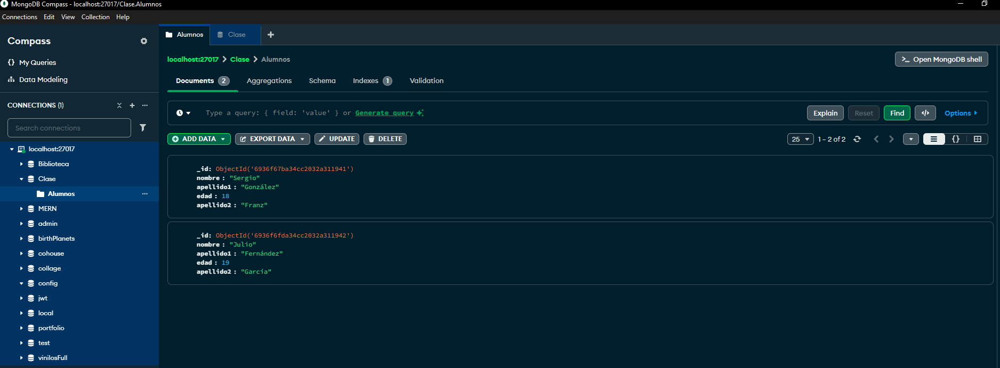
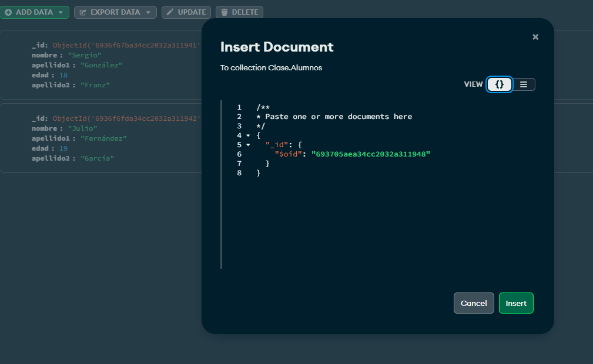

# Conectar a MongoDB desde Java

**1.** Creamos un proyecto desde IntelliJ con `Maven`.

**2.** Debemos tener una base de datos `testDB` y una colección `prodcutos`.

**3.** Tendremos un Main que ejecutará `lecturas`, inserciones, borrados y actualizaciones.

**4.** Crearemos la clase `Usuario` donde estará el CRUD.

**5.** Crearemos una clase de conexión MongoConnection para conectarnos a MongoDB.


**pom.xml**

```java
<dependencies>
    <dependency>
        <groupId>org.mongodb</groupId>
        <artifactId>mongodb-driver-sync</artifactId>
        <version>5.1.0</version>
    </dependency>
</dependencies>
```

**ConnectionBBDD.java**

```java
package org.example;

import java.sql.Connection;
import java.sql.DriverManager;

import com.mongodb.client.MongoClient;
import com.mongodb.client.MongoClients;
import com.mongodb.client.MongoDatabase;

public class ConnectionBBDD {
    // MONGODB la conexión y la base de datos
    private static final String URL_MONGO = "mongodb://localhost:27017";
    private static final String DB_NAME = "Clase";

    public static MongoDatabase getConnectionMongo() {
        try{
            MongoClient client = MongoClients.create(URL_MONGO);
            return client.getDatabase(DB_NAME);
        } catch (Exception e) {
            throw new RuntimeException("Error conectando a MongoDB", e);
        }
    }
}
```
**Alumno.java**

```java
package org.example;

import com.mongodb.client.MongoCollection;
import com.mongodb.client.MongoCursor;
import com.mongodb.client.model.Filters;
import com.mongodb.client.model.Updates;
import org.bson.Document;

public class Alumno {

    private MongoCollection<Document> getCollection() {
        return ConnectionBBDD.getConnectionMongo().getCollection("Alumnos");
    }

    // 1. LISTAR ALUMNOS
    public void listarAlumnos() {
        MongoCursor<Document> cursor = getCollection().find().iterator();

        System.out.println("Listado de alumnos:");
        while (cursor.hasNext()) {
            Document doc = cursor.next();
            System.out.println(
                    doc.getString("nombre") + " " +
                    doc.getString("apellido1") + " " +
                    doc.getString("apellido2") + " " +
                    doc.getInteger("edad") + " "
            );
        }
    }

    // 2. BUSCAR POR NOMBRE
    public boolean findByName(String nombre) {
        Document alumno = getCollection()
                .find(Filters.eq("nombre", nombre))
                .first();

        if (alumno != null) {
            System.out.println("El alumno ya existe: " + nombre);
            return true;
        }

        System.out.println("No existe el alumno: " + nombre);
        return false;
    }

    // 3. INSERTAR ALUMNO
    public void insertAlumno(String nombre, String apellido1, String apellido2, int edad) {

        if (findByName(nombre)) return;

        Document doc = new Document("nombre", nombre)
                .append("apellido1", apellido1)
                .append("apellido2", apellido2)
                .append("edad", edad);

        getCollection().insertOne(doc);

        System.out.println("Alumno insertado: " + nombre);
        listarAlumnos();
    }

    // 4. BORRAR ALUMNO POR NOMBRE
    public void deleteByName(String nombre) {

        long count = getCollection()
                .deleteOne(Filters.eq("nombre", nombre))
                .getDeletedCount();

        if (count > 0) {
            System.out.println("Alumno eliminado: " + nombre);
        } else {
            System.out.println("No existe el alumno: " + nombre);
        }

        listarAlumnos();
    }

    // 5. ACTUALIZAR ALUMNO
    public void actualizarAlumno(String nombreActual, String nombreNuevo, String apellido1Nuevo, String apellido2Nuevo, int edadNueva) {

        long updated = getCollection()
                .updateOne(
                        Filters.eq("nombre", nombreActual),
                        Updates.combine(
                                Updates.set("nombre", nombreNuevo),
                                Updates.set("apellido1", apellido1Nuevo),
                                Updates.set("apellido2", apellido2Nuevo),
                                Updates.set("edad", edadNueva)
                        )
                ).getModifiedCount();

        if (updated > 0) {
            System.out.println("Alumno actualizado: " + nombreActual + " → " + nombreNuevo);
        } else {
            System.out.println("No existe el alumno: " + nombreActual);
        }

        listarAlumnos();
    }
}

```
**Main.java**

```java

public class Main {
    static void main() {
        try {
            ConnectionBBDD.getConnection();
            System.out.println("Conexión correcta a PostgreSQL.");
        } catch (Exception e) {
            System.out.println("Error: " + e.getMessage());
        }
        Alumno alumno = new Alumno();

        // Llama al metodo para ver los alumnos
        alumno.listarAlumnos();
        // Insertar Alumno
        alumno.insertAlumno("ana", "Vázquez", "Guerrero", 25);
        // Actualizar Alumno
        alumno.actualizarAlumno("Mónica", "Mónica", "Blásquez", "Güera", 20);
        // Borrar Alumno
        alumno.deleteByName("ana");
    }
}
```
### Creación de la Base de datos.
Se da click al icono + para añadir la Base de datos nueva.



### Interfaz de Compass
- Se pueden ver todas las demás Bases de datos creadas con anterioridad.
- Si selecionas una de ellas, aparecerán sus documentos con su forma JSON {clave:valor} 



### Insertar un nuevo Documento
Utilizando el formato de JSON, se le irán añadiendo clave y valor de los mismos.


