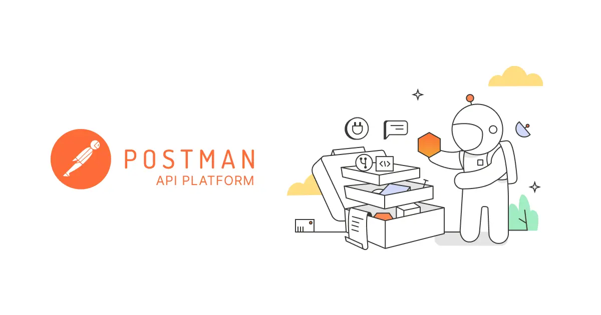
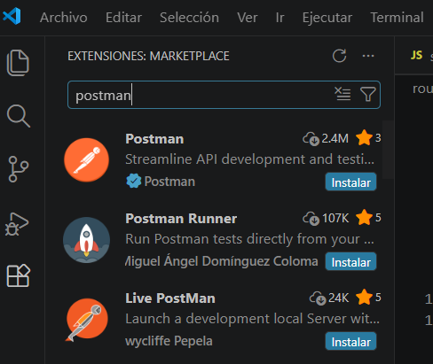
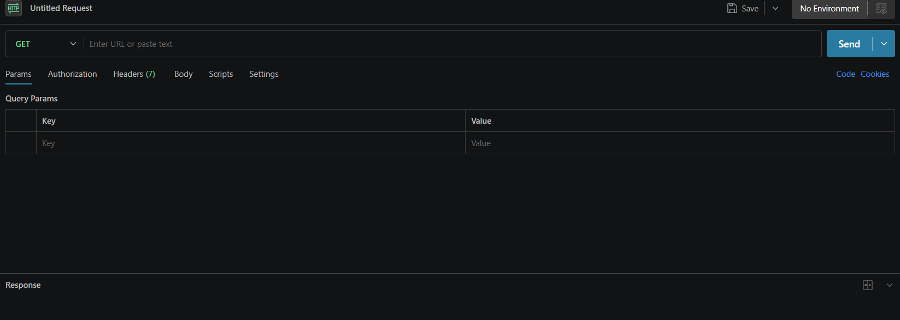

# 📩 POSTMAN

Es una aplicación que permite enviar peticiones HTTP a un servidor y ver la respuesta de forma sencilla, sin necesidad de programar un cliente.

Sirve como “cliente HTTP avanzado” para trabajar con APIs.

**¿Qué permite hacer?**

- Enviar peticiones HTTP (GET, POST, PUT, DELETE)
- Ver respuestas (JSON, estado, tiempo…)
- Guardar requests como colecciones
- Usar variables (entornos)
- Probar APIs mientras programas

## 🔹 Extensión Postman

Existe una extensión oficial para Visual Studio Code que permite usar Postman directamente dentro del editor, sin necesidad de abrir la aplicación de escritorio.

- Se busca como Postman
- Instalar la extensión oficial (la primera que aparece normalmente)

</img>

## 🔹 Panel

En el panel de Postman podemos realizar peticiones a nuestra API o a cualquier otra.
- Introducimos la URL (endpoint) -> http://localhost:3000/api/peliculas
- Seleccionamos el tipo de petición: `GET`, `POST`, `PUT`, `DELETE`, `PATCH`, ...
- Después de enviar la petición, Postman mostrará:
  - La respuesta del servidor (JSON)
  - El código de estado (200, 404, 500…)
  - El tiempo de respuesta

